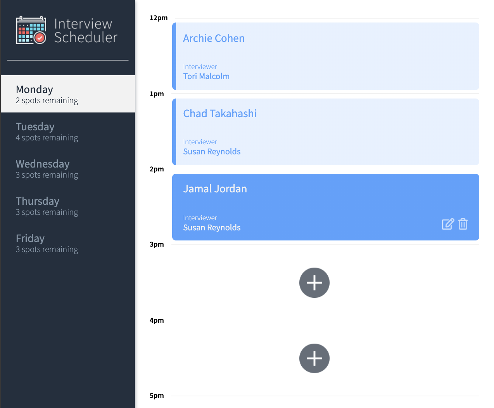
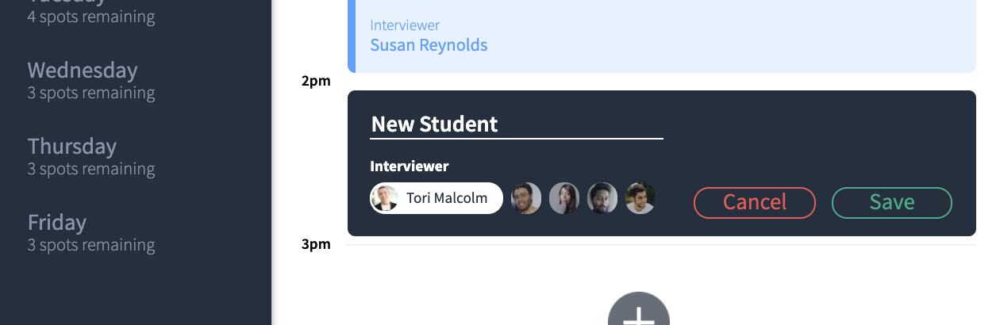

# Interview Scheduler

Interview Scheduler is a React client for booking, editing, and canceling interview appointments. It uses the companion API in [../scheduler-api](../scheduler-api) for all schedule data, and it is designed to work against a local backend during development.

## Features

- View appointments by day
- Book a new interview
- Edit an existing interview
- Cancel an interview
- Track available spots as bookings change

## Screenshots




## Tech Stack

- React
- Axios
- Sass
- Cypress
- Jest

## Getting Started

1. Install dependencies:

```sh
npm install
```

2. Start the API server from the sibling repository:

```sh
cd ../scheduler-api
npm install
npm start
```

3. Start the frontend from this repository:

```sh
npm start
```

4. Open `http://localhost:3000` in your browser.

If your API runs somewhere other than `http://localhost:8001`, set `REACT_APP_API_BASE_URL` before starting the app.

## Available Scripts

### `npm start`

Runs the app in development mode.

### `npm test`

Runs the Jest test suite.

### `npm run build`

Creates a production build.

### `npm run cypress`

Opens Cypress for end-to-end testing.

## Project Notes

- The frontend fetches data from:
  - `GET /api/days`
  - `GET /api/appointments`
  - `GET /api/interviewers`
- It updates appointments with:
  - `PUT /api/appointments/:id`
  - `DELETE /api/appointments/:id`
- The app expects the backend to be running before you load the UI.

## Related Repository

- Backend API: [../scheduler-api](../scheduler-api)
